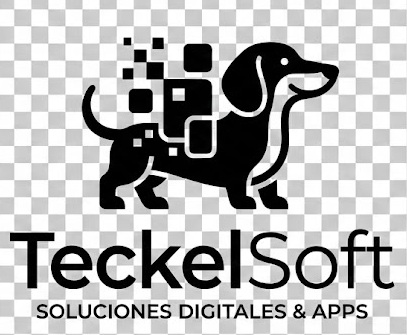

# 🐾 PataLog

<p align="center">
  
</p>

<p align="center">
  <strong>Asistente de transcripción inteligente para consultas veterinarias con IA 100% local</strong>
</p>

<p align="center">
  <a href="#características">Características</a> •
  <a href="#requisitos-del-sistema">Requisitos</a> •
  <a href="#instalación-rápida">Instalación</a> •
  <a href="#uso">Uso</a> •
  <a href="#desarrollo">Desarrollo</a> •
  <a href="#atajos-de-teclado">Atajos</a> •
  <a href="#compilación">Compilación</a>
</p>

<p align="center">
  <a href="https://github.com/PedroGM80/PataLog/actions">
    
  </a>
  <a href="https://github.com/PedroGM80/PataLog/releases">
    
  </a>
  <a href="LICENSE">
    
  </a>
</p>

---

## ✨ Características

- 🎙️ **Grabación de audio** profesional de consultas veterinarias
- 📝 **Transcripción automática** con Whisper (modelo local de OpenAI)
- 🤖 **Generación de informes clínicos** con Ollama (LLM local descentralizado)
- 📄 **Exportación a PDF** profesional con datos de la clínica y propietario
- 🗃️ **Historial de consultas** con búsqueda avanzada por fecha
- 👥 **Gestión completa** de pacientes y propietarios (CRUD)
- 🌙 **Tema oscuro/claro** con Material Design 3
- ⌨️ **Atajos de teclado** optimizados para veterinarios
- 🔒 **100% local** - Tus datos nunca salen de tu ordenador
- 🚀 **Interfaz moderna** con Compose Desktop (Kotlin)

## 🖥️ Requisitos del sistema

### Mínimos
- **OS**: Windows 10/11, macOS 10.15+, o Linux (Ubuntu 20.04+)
- **RAM**: 8 GB (16 GB recomendado para LLM)
- **Disco**: 15 GB libres (10 GB para app + 5 GB para modelos de IA)
- **Procesador**: Intel/AMD x64 o Apple Silicon

### Software requerido

| Componente | Versión | Descripción | Descarga |
|-----------|---------|-------------|----------|
| **Python** | 3.13+ | Backend y procesamiento | [python.org](https://www.python.org/downloads/) |
| **JDK** | 17+ | Runtime Java para Kotlin | [Eclipse Temurin](https://adoptium.net/) |
| **Ollama** | Última | LLM local (opcional si usas API) | [ollama.ai](https://ollama.ai) |
| **Git** | Cualquiera | Control de versiones | [git-scm.com](https://git-scm.com) |

### Dependencias de desarrollo (solo si compilas)

| Tecnología | Versión | Propósito |
|-----------|---------|----------|
| **Kotlin** | 2.3.10 | Lenguaje del frontend |
| **Gradle** | 9.3.0+ | Build system |
| **Compose Desktop** | 1.9.3 | Framework UI |

## 📦 Instalación rápida

### Opción 1: Instalador Windows (Recomendado)

1. Descarga el instalador MSI desde [Releases](https://github.com/PedroGM80/PataLog/releases)
2. Ejecuta el instalador
3. Instala [Ollama](https://ollama.ai) si necesitas modelos locales
4. ¡Listo! Abre PataLog desde el menú Inicio

### Opción 2: Instalación desde fuente (Desarrollo)

#### 1. Instalar dependencias

**Windows:**
```batch
# Instalar Python 3.13 desde https://www.python.org
# Instalar JDK 17+ desde https://adoptium.net
# Instalar Git desde https://git-scm.com
# Instalar Ollama desde https://ollama.ai (opcional)

# Verificar instalación
python --version  # Debe ser 3.13+
java -version     # Debe ser 17+
```

**Linux/macOS:**
```bash
# Ubuntu/Debian
sudo apt-get install python3.13 openjdk-17-jdk git

# macOS (con Homebrew)
brew install python@3.13 openjdk@17 git ollama

# Verificar instalación
python3 --version  # Debe ser 3.13+
java -version     # Debe ser 17+
```

#### 2. Clonar repositorio

```bash
git clone https://github.com/PedroGM80/PataLog.git
cd PataLog
```

#### 3. Instalar Ollama y descargar modelo (opcional)

```bash
# Descargar modelo LLM local (requiere ~4GB)
ollama pull llama2

# O instalar Mistral (más pequeño, ~4GB)
ollama pull mistral

# O instalar Neural Chat (optimizado, ~4GB)
ollama pull neural-chat
```

#### 4. Instalar dependencias Python

```bash
cd backend
python -m pip install --upgrade pip
pip install -r requirements.txt
```

#### 5. Ejecutar aplicación

```bash
cd ../app

# Windows
gradlew.bat run

# Linux/macOS
./gradlew run
```

## 📖 Uso

### Flujo de trabajo típico

#### 1️⃣ **Configuración inicial** (primera ejecución)
```
Menú → Ajustes
├─ Datos de clínica (nombre, dirección, teléfono)
├─ Datos del veterinario (licencia)
├─ Seleccionar modelo IA (si Ollama está disponible)
└─ Guardar configuración
```

#### 2️⃣ **Nueva consulta**
```
Pantalla Consulta → Nuevo paciente (si no existe)
├─ Seleccionar o crear paciente
├─ Grabar consulta (Ctrl+R o F5)
├─ Hablar normalmente durante la consulta
└─ Detener grabación (Ctrl+R o F5)
```

#### 3️⃣ **Generar informe**
```
Transcripción automática
├─ Editar texto si es necesario
├─ Generar informe con IA (Ctrl+G)
├─ Revisar informe generado
└─ Editar como sea necesario
```

#### 4️⃣ **Guardar y exportar**
```
├─ Guardar consulta (Ctrl+S)
├─ Exportar a PDF profesional (Ctrl+E)
└─ PDF incluye: consulta, informe, datos paciente, sello clínica
```

### Pantallas principales

| Pantalla | Función | Atajo |
|----------|---------|-------|
| **Consulta** | Grabar, transcribir y generar informes | `Ctrl+1` |
| **Pacientes** | Gestionar animales (crear, editar, eliminar) | `Ctrl+2` |
| **Propietarios** | Gestionar dueños de mascotas | `Ctrl+3` |
| **Historial** | Ver consultas anteriores con filtros | `Ctrl+4` |
| **Ajustes** | Configuración de clínica, IA, tema | `Ctrl+,` |

## ⌨️ Atajos de teclado

### Navegación global
| Atajo | Acción |
|-------|--------|
| `Ctrl+1` | Ir a Consulta |
| `Ctrl+2` | Ir a Pacientes |
| `Ctrl+3` | Ir a Propietarios |
| `Ctrl+4` | Ir a Historial |
| `Ctrl+,` | Ir a Ajustes |
| `Ctrl+Q` | Salir de aplicación |

### Pantalla de consulta
| Atajo | Acción |
|-------|--------|
| `Ctrl+R` / `F5` | Grabar / Detener |
| `Ctrl+G` | Generar informe con IA |
| `Ctrl+S` | Guardar consulta |
| `Ctrl+E` | Exportar a PDF |
| `Ctrl+L` | Limpiar formulario |
| `Escape` | Cancelar grabación |

### Listas (Pacientes/Propietarios)
| Atajo | Acción |
|-------|--------|
| `Ctrl+N` | Crear nuevo elemento |
| `Ctrl+F` | Buscar en lista |
| `Delete` | Eliminar seleccionado |
| `Escape` | Cerrar diálogo |

## 🛠️ Desarrollo

### Estructura del proyecto

```
PataLog/
├── app/                           # Frontend - Kotlin + Compose Desktop
│   ├── src/main/kotlin/com/patalog/
│   │   ├── ui/
│   │   │   ├── screens/          # Pantallas principales
│   │   │   ├── components/       # Componentes reutilizables
│   │   │   └── theme/            # Temas y estilos
│   │   ├── data/
│   │   │   ├── repositories/     # Acceso a BD SQLite
│   │   │   └── models/           # Modelos de datos
│   │   ├── domain/
│   │   │   └── models/           # Entidades del dominio
│   │   ├── backend/
│   │   │   └── BackendClient.kt  # Cliente del backend Python
│   │   ├── audio/
│   │   │   └── AudioRecorder.kt  # Grabación de audio
│   │   └── Main.kt               # Punto de entrada
│   ├── src/test/                 # Tests unitarios
│   └── build.gradle.kts          # Configuración Gradle
│
├── backend/                       # Backend - Python
│   ├── src/
│   │   ├── main.py               # Punto de entrada
│   │   ├── protocol.py           # Protocolo JSON stdin/stdout
│   │   ├── handlers/
│   │   │   ├── transcribe.py     # Manejo de transcripción
│   │   │   ├── report.py         # Generación de informes
│   │   │   └── export.py         # Exportación PDF
│   │   ├── services/
│   │   │   ├── whisper.py        # Servicio de transcripción
│   │   │   └── ollama.py         # Servicio LLM
│   │   └── models/               # Modelos de datos
│   ├── requirements.txt          # Dependencias Python
│   └── patalog-backend.spec      # Config PyInstaller
│
├── .github/
│   └── workflows/
│       ├── ci.yml                # CI: lint, test, análisis
│       └── release.yml           # CD: builds Windows/Linux
│
├── README.md                      # Este archivo
├── LICENSE                        # MIT License
└── PLANNING.md                    # Roadmap del proyecto
```

### Arquitectura

```
┌──────────────────────────┐           ┌──────────────────────────┐
│   Kotlin/Compose UI      │           │   Python Backend         │
│      (Frontend)          │◄─JSON──────│                          │
│                          │──JSON──────┤  (Servidor subproceso)  │
└────────────┬─────────────┘           └────┬─────────────┬────────┘
             │ SQL                          │             │
             ▼                              ▼             ▼
        ┌─────────┐                   ┌──────────┐  ┌──────────┐
        │  SQLite │                   │ Whisper  │  │ Ollama   │
        │   DB    │                   │ (OpenAI) │  │   LLM    │
        └─────────┘                   └──────────┘  └──────────┘
```

**Comunicación**: JSON sobre stdin/stdout (robusto y multiplataforma)

### Stack tecnológico actualizado (2026)

**Frontend** (Kotlin/Compose, 2026)
- Kotlin 2.3.10 (K2 compiler)
- Compose Desktop 1.9.3
- Material Design 3
- SQLite con JDBC 3.51.2.0

**Backend** (Python, 2026)
- Python 3.13.12
- OpenAI Whisper 20250625
- Ollama (último)
- ReportLab 4.4.10
- python-dotenv 1.2.1

**Build & Deploy** (2026)
- Gradle 9.3.0+
- GitHub Actions (CI/CD optimizado)
- PyInstaller (empaquetado backend)
- WiX Toolset (instaladores Windows)

### Comandos de desarrollo

```bash
# Ejecutar en modo desarrollo
cd app && ./gradlew run              # Linux/macOS
cd app && gradlew.bat run            # Windows

# Ejecutar tests
cd app && ./gradlew test

# Linter (ktlint)
cd app && ./gradlew ktlintCheck

# Análisis de código (detekt)
cd app && ./gradlew detekt

# Coverage de tests (JaCoCo)
cd app && ./gradlew jacocoTestReport

# Compilación backend (PyInstaller)
cd backend && python -m PyInstaller patalog-backend.spec

# Empaquetar para Windows (MSI + EXE)
cd app && gradle packageMsi packageExe

# Empaquetar para Linux (DEB)
cd app && gradle packageDeb

# Empaquetar para macOS (DMG)
cd app && gradle packageDmg
```

### Flujo de desarrollo

1. **Crear rama feature**
   ```bash
   git checkout -b feature/nueva-funcionalidad
   ```

2. **Hacer cambios y tests**
   ```bash
   cd app && ./gradlew test    # Ejecutar tests
   cd app && ./gradlew detekt  # Análisis de código
   cd app && ./gradlew ktlintCheck  # Format
   ```

3. **Commit y push**
   ```bash
   git add .
   git commit -m "feat: descripción de cambios"
   git push origin feature/nueva-funcionalidad
   ```

4. **Pull Request**
   - Abre PR en GitHub
   - CI/CD ejecutará automáticamente
   - Espera aprobación y merge

### CI/CD Pipeline

El proyecto usa **GitHub Actions** para automatizar:

**CI (Pull Requests)**
- ✅ Lint con ktlint
- ✅ Análisis con detekt y flake8
- ✅ Tests unitarios (JUnit5)
- ✅ Análisis de seguridad (bandit)
- ✅ Type checking (mypy)

**CD (Releases)**
- ✅ Build Windows (MSI + EXE) en windows-latest
- ✅ Build Linux (DEB) en ubuntu-latest
- ✅ Auto-upload artifacts
- ✅ Create release con archivos

## 🏗️ Compilación

### Generar instalador Windows

```bash
# MSI (recomendado para distribución)
cd app && gradle packageMsi

# EXE (instalador alternativo)
cd app && gradle packageExe

# Ambos
cd app && gradle packageMsi packageExe
```

Artifacts estarán en: `app/build/compose/binaries/main/`

### Generar instalador Linux

```bash
cd app && gradle packageDeb

# Artifact: app/build/compose/binaries/main/deb/PataLog-*.deb
```

### Generar instalador macOS

```bash
cd app && gradle packageDmg

# Artifact: app/build/compose/binaries/main/dmg/PataLog-*.dmg
```

## 📋 Requisitos de instalación del usuario final

Para **ejecutar** PataLog (no compilar):

- **Python 3.13+** (automático si usas instalador)
- **Ollama** (si quieres usar LLM local)
- **Micrófono** para grabar consultas
- **4GB RAM mínimo**, 16GB recomendado

## 🤝 Contribución

¡Las contribuciones son bienvenidas! Por favor:

1. **Fork** el repositorio
2. **Crea rama** con tu feature: `git checkout -b feature/nueva-funcionalidad`
3. **Haz commits** claros: `git commit -m "feat: descripción"`
4. **Asegúrate** de que pasan tests: `./gradlew test detekt`
5. **Push** a tu rama: `git push origin feature/nueva-funcionalidad`
6. **Abre Pull Request** con descripción clara

### Guía de commits

```
feat:   Nueva funcionalidad
fix:    Corrección de bug
docs:   Cambios en documentación
style:  Formato, lint, sin cambios lógicos
refactor: Refactorización sin cambios de funcionalidad
test:   Agregar o actualizar tests
ci:     Cambios en CI/CD
chore:  Cambios en build, deps, etc
```

## 🐛 Reportar bugs

Abre un [Issue](https://github.com/PedroGM80/PataLog/issues) con:
- Descripción clara del problema
- Pasos para reproducir
- Versión de SO y Python
- Logs si es posible

## 📄 Licencia

Distribución bajo Licencia MIT. Ver [LICENSE](LICENSE) para detalles.

## 📞 Soporte

- 📚 [Documentación técnica](PLANNING.md)
- 🐛 [Issues & bugs](https://github.com/PedroGM80/PataLog/issues)
- 💬 [Discussions](https://github.com/PedroGM80/PataLog/discussions)

---

<p align="center">
  Desarrollado con ❤️ por <a href="https://github.com/PedroGM80">TeckelSoft</a>
</p>

<p align="center">
  <a href="https://github.com/PedroGM80/PataLog/stargazers">
    
  </a>
  <a href="https://github.com/PedroGM80/PataLog/network/members">
    
  </a>
</p>
